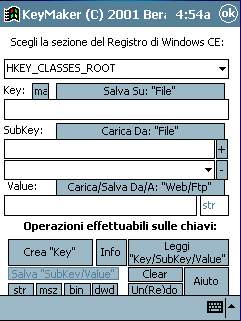



## windows ce registry editor

### Description

sample application that writes ALL KINDS OF KEYES SUPPORTED BY WINDOWS 32BIT , written for windows ce systems using embedded visual basic 3.0
 
### More Info
 

             |
---                |---
**Submitted On**   |2001-08-01 08:16:28
**By**             |[michele berardi](https://github.com/Planet-Source-Code/PSCIndex/blob/master/ByAuthor/michele-berardi.md)
**Level**          |Advanced
**User Rating**    |5.0 (15 globes from 3 users)
**Compatibility**  |VB 3\.0, VB 4\.0 \(16\-bit\), VB 4\.0 \(32\-bit\), VB 5\.0, VB 6\.0, VB Script, ASP \(Active Server Pages\) , VBA MS Access, VBA MS Excel
**Category**       |[Windows CE](https://github.com/Planet-Source-Code/PSCIndex/blob/master/ByCategory/windows-ce__1-41.md)
**World**          |[Visual Basic](https://github.com/Planet-Source-Code/PSCIndex/blob/master/ByWorld/visual-basic.md)
**Archive File**   |[windows ce23852812001\.zip](https://github.com/Planet-Source-Code/michele-berardi-windows-ce-registry-editor__1-25642/archive/master.zip)

